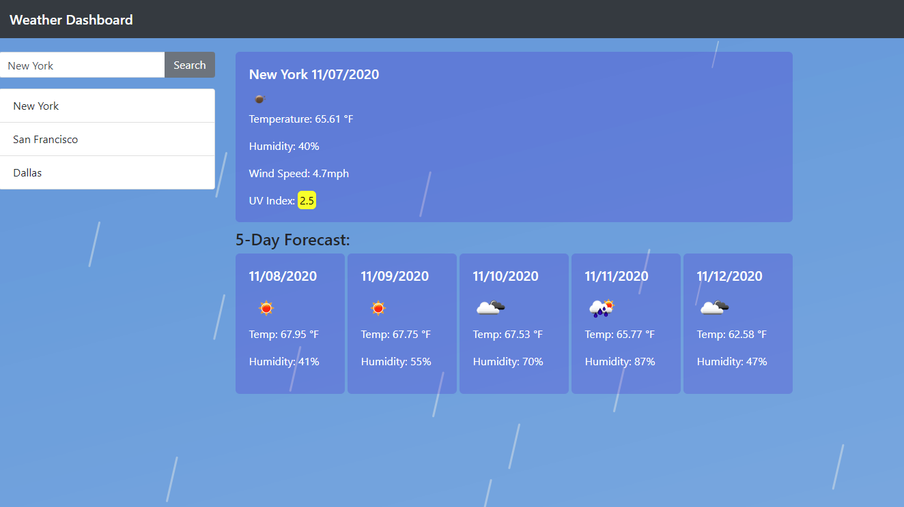

# Weather Dashboard
This Weather Dashboard app pulls from the openweather api to create a live weather data dashboard. 

## Features
This app features a search bar with interactive history elements that can be used to re run a previous query, on mouseover these elements are highlighted. Exhibiting the weather data is a banner/panel that shows
today's weather. This app also includes a simplified five day forecast, with date, weather icon, temperature, and humidity.

## Diagram

[Link to live app](https://jtwob.github.io/Weather_App/)